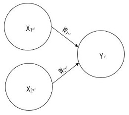
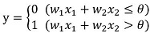
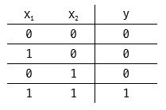
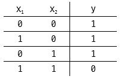
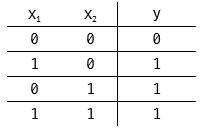
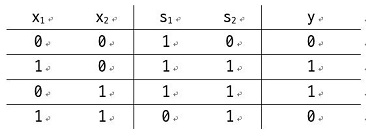
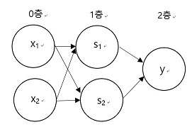

# 밑바닥부터 시작하는 딥러닝
## Chapter 02 Perceptron 퍼셉트론
### 퍼셉트론(Perceptron)
- 퍼셉트론: 다수의 입력을 받아 하나의 신호 출력(흐른다/흐르지 않는다)
    - 신호: 흐름이 있는 어떤 것
    -   
    - 뉴런/노드: 그림의 원
    - 가중치(Weight): 입력 신호(X1, X2)가 뉴런에 보내질 때 곱하는 값 
    신호의 총 합이 정해진 한계(임계값, θ)를 넘을 때 1을 출력
    - 임계값(θ): 정해진 신호 출력의 한계를 나타내는 기준값
    - **가중치가 클 수록 해당 신호는 중요**

### 논리 회로
- AND Gate
    - 진리표
        - 
        - 입력이 모두 1일 때에만 1 출력
    - 퍼셉트론으로 표현 - W1(가중치1), W2(가중치2), θ(임계값)의 값 정하기
        - Ex) (W1, W2, θ) - (0.5, 0.5, 0.7) 
- NAND Gate
    - 진리표
        - 
        - AND의 부정
    - 퍼셉트론으로 표현
        - Ex) (W1, W2, θ) - (-0.5, -0.5, -0.7)
- OR Gate
    - 진리표
        - 
    - 퍼셉트론으로 표현
        - Ex) (W1, W2, θ) - (0.5, 0.5, 0.2)
        
>책에서 풀어보라고 했는데 완전 답을 틀려놨는데 여기서 생각을 잘 못 했던게 
>가중치가 W1 = 0.5, W2 = 0.5라고 고정 했을 때 가중치 매개변수(θ)으로만 출력을 조절할 수 있음 
>(X1, X2는 입력 값이므로 관련 없음) 
>입력값 X1, X2가 0, 0이나 0, 1/1, 0/1, 1 일 때 각각의 상황에서 참이 되기 위한 매개 변수는 
>0, 0.5, 0.5, 1일 때 참이 되며 따라서 x_x 0, 0일때만 거짓이고 나머지가 참이 되어야 하는 OR Gate는 
>(W1, W2, θ) - (0.5, 0.5, 0.2)가 되어야 한다(0.2는 0.5보다 작기만 하면 상관없음)

### 퍼셉트론으로 논리 회로 구현
- 가중치와 편향을 도입한 식
    - 
    - 편향(Bias): b로 표현한다. θ와 동일
    - 식의 관점에서 보는 퍼셉트론: 입력 신호에 가중치를 곱한 값과 편향을 합하여 0을 넘으면 1을 출력하고, 
    그 외에는 0을 출력
    - **가중치(W1, W2): 입력 신호가 결과에 주는 영향력(중요도)을 조절하는 매개변수**
    - **편향(b): 뉴런이 얼마나 쉽게 활성화하느냐를 조정하는 매개변수**
- AND Gate
    - [AndGate.py](C02/AndGate.py)
- NAND Gate
    - [NandGate.py](C02/NandGate.py)
- OR Gate
    - [OrGate.py](C02/OrGate.py)
- AND, NAND, OR 모두 같은 구조의 퍼셉트론이며 **가중치 매개변수의 값** 만이 다르다.

### 퍼셉트론의 한계
- XOR Gate
    - 
    - 지금까지 배운 퍼셉트론으로는 불가능
    - 
        - 직선으로 나뉜 각각의 영역은 0과 1을 의미
    - XOR 게이트로는 출력을 이용하여 그래프 상에서 영역을 나눌 수 없음
    - **XOR 게이트는 비선형이며, AND/NAND/OR Gate는 선형**

### 다층 퍼셉트론의 한계
- XOR Gate 조합해서 구현
    - 
    - 
        - 이와 같이 다층인 퍼셉트론을 다층 퍼셉트론이라고 부름
        - 0층의 두 뉴런이 입력신호를 받아 1층의 뉴런으로 신호를 보내고, 
        1층의 뉴런이 2층의 뉴런으로 신호를 보내고, 2층의 뉴런은 이 입력 신호를 바탕으로 y를 출력
    - XOR Gate
        - [XORGate.py](C02/XorGate.py)

### 정리
- '가중치'와 '편향'을 매개 변수로 한 퍼셉트론은 입력을 주면 정해진 규칙에 의해 값을 출력함
- 퍼셉트론에서 논리 회로를 표현할 수 있음
- 다층 퍼셉트론은 비선형 구조도 표현 가능